# Carmen Chatbot — System Flowchart

```mermaid
flowchart TD
    A([HTTP Request\nPOST /api/chat/stream]) --> B{Origin\nValidation}
    B -- Blocked --> ERR1([403 Forbidden])
    B -- Allowed --> C{Rate Limit\nCheck}
    C -- Exceeded --> ERR2([429 Too Many Requests])
    C -- OK --> D{Daily Budget\nCheck}
    D -- Exhausted --> ERR3([429 Budget Exceeded])
    D -- OK --> E[chat_service\nstream_chat / invoke_chat]

    E --> F[Parse device_type\nfrom User-Agent]
    F --> G[[Intent Detection\nintent_router.detect_intent]]

    %% ── Intent Detection ──────────────────────────────────────────
    subgraph INTENT ["Intent Router (3-Stage Pipeline)"]
        direction TB
        I1{Stage 1\nRegex Fast-Track}
        I1 -- Match --> I1R([Return intent\n+ canned response])
        I1 -- No match --> I2{Stage 2\nVector Similarity\nCosine ≥ threshold?}
        I2 -- Hard Match\nscore ≥ per-category threshold --> I2R([Return intent\n+ canned response])
        I2 -- Soft Zone\n0.75 ≤ score < threshold --> I3{Top-K\nConsensus ≥ 2?}
        I3 -- Yes\nnot confusion --> I3R([Return intent\n+ canned response])
        I3 -- No --> I4[[Stage 3\nLLM Classifier\ngemini-flash-lite]]
        I2 -- No match --> I4
        I4 --> I4R([Return classified\nintent])
    end

    G --> INTENT
    INTENT --> H{Intent\nCategory?}

    %% ── Canned-response intents ────────────────────────────────────
    H -- greeting / thanks\nout_of_scope\ncompany_info\ncapabilities\nconfusion --> CANNED[Return canned\nresponse immediately]
    CANNED --> LOG

    %% ── Tech-support path ──────────────────────────────────────────
    H -- tech_support --> TS1{Conversation\nHistory?}
    TS1 -- Yes --> TS2[[Query Rewrite\n_rewrite_query via LLM]]
    TS2 --> LANG
    TS1 -- No --> LANG

    LANG{Language Detect\n_detect_lang\n≥15% Thai chars?}
    LANG -- Thai --> TS3[[Hybrid Retrieval\nretrieval.search]]
    LANG -- Non-Thai --> TRANS[[Translate to Thai\n_translate_query_to_thai\nactive_intent_model]]
    TRANS --> TS3

    subgraph RETRIEVAL ["Hybrid Retrieval Pipeline"]
        direction TB
        R1[[Embed query\nOpenRouter Embedding API]] --> R2
        R2[[Vector Search\npgvector cosine distance < 0.45]] & R3[[Keyword Search\nPostgreSQL FTS ts_rank_cd]]
        R2 --> R4[[Reciprocal Rank Fusion\nRRF score = 1÷60+rank_v + 1÷60+rank_k]]
        R3 --> R4
        R4 --> R5[[Path Boost\npath_rules.yaml keyword rules\n+0.02 RRF bonus]]
        R5 --> R6[[Deduplicate + Top-K=4\nResolve image URLs]]
    end

    TS3 --> RETRIEVAL
    RETRIEVAL --> ZR{Zero\nResults?}
    ZR -- Yes --> CANNED2[Return out_of_scope\ncanned response\nhad_zero_results=True]
    CANNED2 --> LOG

    ZR -- No --> TB[Token Budget\nTrim context to fit\nMAX_PROMPT_TOKENS]
    TB --> PB[[Build Prompt\nprompt_builder.build_messages\nsystem + history + context + question]]

    PB --> LLM[[LLM Generation\nllm_client stream / invoke]]

    subgraph LLM_CALL ["LLM Client (with Retry & Fallback)"]
        direction TB
        L1[Try primary model\nLLM_CHAT_MODEL] --> L2{Success?}
        L2 -- Yes --> L3([Stream chunks\nNDJSON])
        L2 -- 429 / 5xx --> L4{Retries left?\nexp. backoff 2ⁿ s}
        L4 -- Retry --> L1
        L4 -- Exhausted --> L5{Fallback\nmodel set?}
        L5 -- Yes --> L6[Try LLM_FALLBACK_MODEL] --> L2
        L5 -- No --> L7([Format error\nresponse])
    end

    LLM --> LLM_CALL
    LLM_CALL --> POST[Post-process stream\nFilter SUGGESTIONS tag\nCheck finish_reason]

    POST --> STREAM[Stream response to client\nchunks → sources → suggestions → done]
    STREAM --> LOG

    %% ── Logging ────────────────────────────────────────────────────
    subgraph LOG ["Logging — chat_history.save_chat_logs"]
        direction LR
        M1[intent_tokens\nrewrite_tokens\nembed_tokens]
        M2[chat_input_tokens\nchat_output_tokens\nduration / ttft_ms]
        M3[device_type\nreferrer_page\navg_similarity_score]
        M4[was_rewritten\nhad_zero_results\nwas_truncated\nretrieved_chunks]
    end

    LOG --> DB[(PostgreSQL\npublic.chat_history)]

    %% ── Styles ─────────────────────────────────────────────────────
    classDef error fill:#ffcccc,stroke:#cc0000,color:#000
    classDef canned fill:#d4edda,stroke:#28a745,color:#000
    classDef stage fill:#cce5ff,stroke:#004085,color:#000
    classDef db fill:#fff3cd,stroke:#856404,color:#000

    class ERR1,ERR2,ERR3 error
    class CANNED,CANNED2,I1R,I2R,I3R,I4R canned
    class I1,I2,I3,I4 stage
    class DB db
```



## Component Reference

| Stage | File | Key Logic |
|---|---|---|
| HTTP routing | `api/chat_routes.py` | Rate limit, budget check, stream vs invoke |
| Orchestration | `llm/chat_service.py` | Full request lifecycle, metrics |
| Intent routing | `llm/intent_router.py` | Regex → vector cosine → LLM classifier |
| Retrieval | `llm/retrieval.py` | Embed → pgvector → FTS → RRF → path boost |
| Query translation | `llm/llm_client.py` | `_detect_lang` (Thai Unicode ≥15%) → `_translate_query_to_thai` via `active_intent_model` |
| LLM client | `llm/llm_client.py` | Model creation, retry, fallback, token estimation |
| Prompt building | `llm/prompt_builder.py` | System + history + context assembly |
| History & logging | `llm/chat_history.py` | Session cache, DB insert, PII masking |

## Intent Thresholds (Vector Stage)

| Intent | Cosine Similarity Threshold |
|---|---|
| confusion | 0.92 (strictest) |
| greeting | 0.90 |
| thanks | 0.90 |
| capabilities | 0.88 |
| out_of_scope | 0.88 |
| company_info | 0.82 (most lenient) |
| Soft zone (any) | 0.75 – threshold |
```
