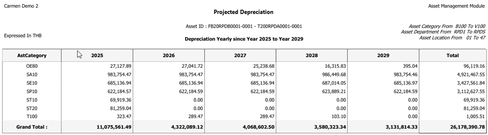
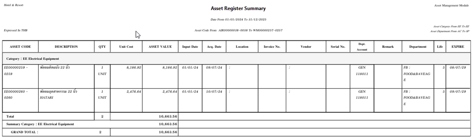
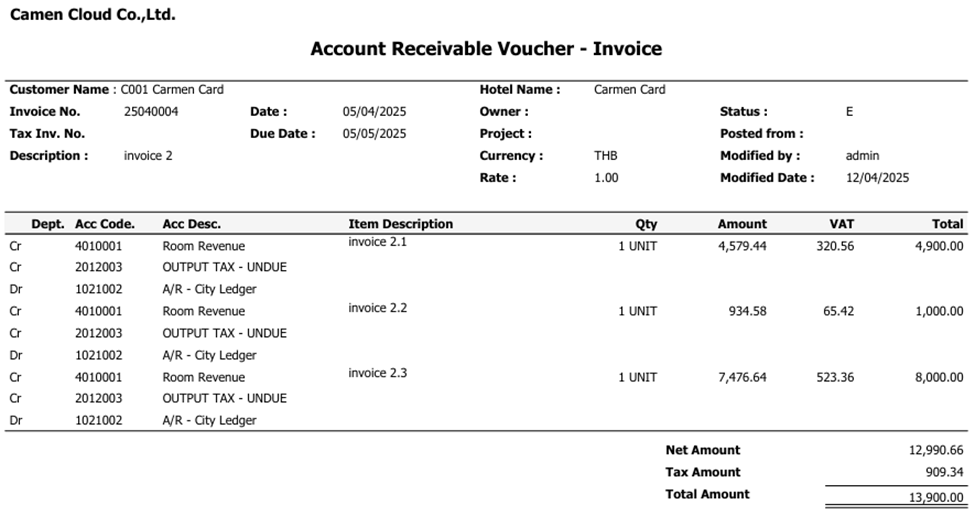
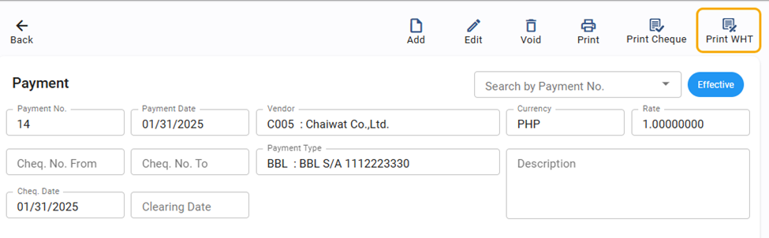
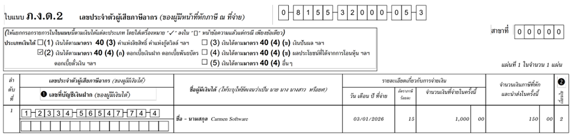
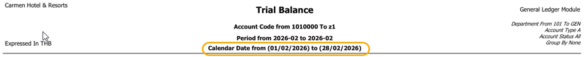
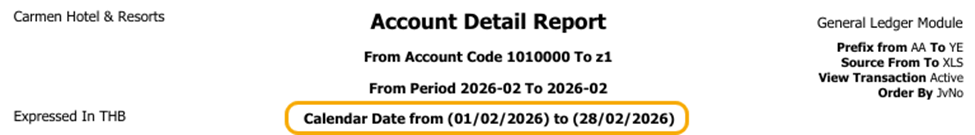

# Carmen Cloud: February 2026 Release Highlights

We are happy to share the latest updates for Carmen Cloud this February 2026. This version focuses on making your work easier, improving data accuracy, and connecting your systems more smoothly.

## AddIn

### Title: Accurate Daily Calculations (v3.970)
- **Note**: The Daily Formula now correctly pulls data based on your specific fiscal periods instead of standard calendar dates. This ensures accurate calculations even for non-standard accounting cycles.
- **Path**: Carmen AddIn > Formula

### Title: Secure Budget Import Management (v3.970)
- **Note**: Keep your budget data safe and clean. We’ve added advanced validation to prevent duplicate entries and block imports into closed accounting periods, giving you total control and better data integrity.
- **Path**: Carmen AddIn > Budget Import

## Asset Management
### Title: More Accurate Depreciation for Disposed Assets
- **Note**: The system now calculates depreciation more precisely, counting every day until the day before you dispose of an asset. This ensures your financial records show the most accurate value possible.
- **Path**: Asset > Disposal

### Title: New Report: Projected Depreciation
- **Note**: Plan your future budget easily with the new "Projected Depreciation" report. This tool shows you how much depreciation to expect in the coming years, helping you manage your long-term financial plans better.
- **Path**: Asset > Report > Projected Depreciation

    

### Title: New Asset Register Summary Report
- **Note**: You can now see a quick overview of all your assets grouped by category. This new summary report helps management and accounting teams check asset totals quickly and easily.
- **Path**: Asset > Report > Register Summary

    

## Account Receivable
### Title: Secure Folio Posting Control
- **Note**: To keep your data clean and correct, the system now prevents you from re-posting any folio that has already been converted into an invoice. This safety feature helps maintain high data accuracy.
- **Path**: Account Receivable > Folio
### Title: Clearer Account Code Display on AR Vouchers
- **Note**: We have updated the "Account Receivable Voucher - Invoice" form to show account codes more clearly. This makes it much easier for you to check and verify your accounting information.
- **Path**: Account Receivable > Receipt > Print voucher

    

 
## Account Payable
### Title: New! Quick "Print WHT" for Payments (Philippines)
- **Note**: For our users in the Philippines, we have added a dedicated "Print WHT" button directly on the payment screen. This update makes it much faster to generate withholding tax documents (BIR Form No. 2307) right when you process your payments.
- **Path**: Account Payable > Payment

    

 
### Title: New PND 2 Report for Tax Compliance (Thailand)
- **Note**: We have introduced the new PND 2 report to support our Thai users. This tool helps you manage and prepare your tax filings for specific income types more accurately and easily.
- **Path**: Account Payable > Procedure > Withholding Tax reconciliation

    

 
## General Ledger
### Title: Integrated Fiscal Period and Date Display
- **Note**: We have updated the Trial Balance and Account Detail reports to show the specific dates alongside each fiscal period. This helps you clearly see the date range for each period, which is very useful for businesses with fiscal years that cross over calendar years.
- **Path**: General Ledger > Report > Trial Balance / Account Detail

    

 

    

### Title: New Guestline PMS Integration (via API)
- **Note**: Connecting with Guestline PMS is now easier and faster. Our new API integration allows you to control settings and sync data directly within Carmen Cloud, giving you more flexibility and saving you time.
- **Path**: General Ledger > Procedure > Guestline Inteface

