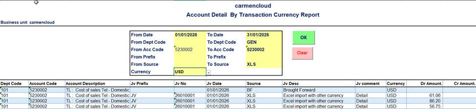
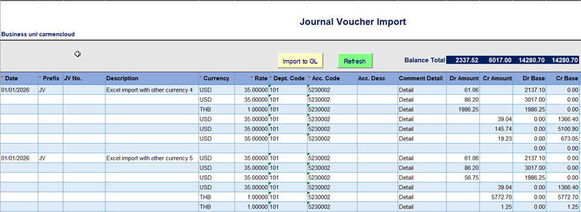
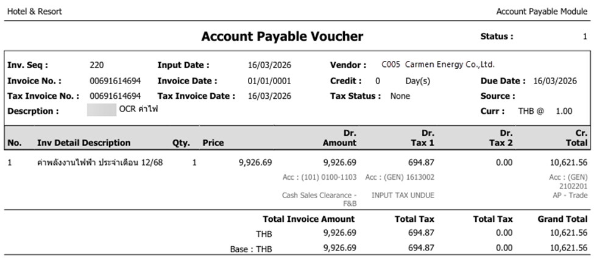

# Carmen Cloud: March 2026 Release Highlights

We are thrilled to announce the March 2026 updates for Carmen Cloud. This version focuses on empowering your financial operations with superior data integrity, enhanced visibility for global transactions, and streamlined compliance tools to ensure your business remains agile and precise.

## AddIn

### Title: Global Financial Visibility: Transaction Currency in Account Detail (v3.971)
- **Note**: Take your international financial analysis to the next level! The "Account Detail" report in the Excel AddIn now supports viewing values in their native Transaction Currency. This allows for real-time valuation insights and clearer auditing of overseas transactions, enabling faster and more informed global decision-making. To access this feature, please ensure you have updated your Add-In to version 3.971 and downloaded the latest workbook version.
- **Path**: Carmen AddIn > Account Detail By Transaction

    

### Title: Precision Multi-Currency JV Import Engine (v3.971)
- **Note**: Manage cross-border accounting entries with total confidence. Our JV Import tool has been upgraded to seamlessly record Transaction Currency data. This enhancement ensures that every multi-currency entry imported from Excel into your core system is processed with absolute accuracy and integrity.
- **Path**: Carmen AddIn > JV Multiple Import

    

## Account Payable
### Title: Advanced Data Integrity: Input Tax Security Guard
- **Note**: We have enhanced the security of the Receiving Repost process by implementing a status validation check. The system now prevents re-posting if an Invoice is already confirmed or filed. This update helps maintain the accuracy of your tax records and prevents unintended data overwrites.
- **Path**: Account Payable > Procedure > Posting from Receiving

### Title: Enhanced Transparency: Detailed AP Vouchers
- **Note**: Audit and verification are now simpler and more transparent. The revised Account Payable Voucher form now displays the specific Account Code for every detail line and includes the Base Currency amount, providing a comprehensive view of your financial commitments at a glance.
- **Path**: Account Payable > AP Invoice > Print

    

### Title: Streamlined Tax Compliance: Ready for PND 2
- **Note**: Simplify your tax filing season with our updated compliance tools. We have integrated new data fields into the WHT Reconciliation export utility specifically for PND 2 filing. This update reduces manual data preparation and ensures your tax submissions are accurate and timely.
- **Path**: Account Payable > Procedure > Withholding Tax Reconciliation

## General Ledger
### Title: Instant Context: Enhanced Vendor Traceability in Comments
- **Note**: Enhance your reporting clarity and audit trails. For Journal Vouchers originating from AP Payments, the system now automatically includes the Vendor Code and Vendor Name within the comments. This improvement provides immediate visibility of the vendor context for each entry in your General Ledger, making reconciliation and verification more efficient.
- **Path**: General Ledger > Journal Voucher