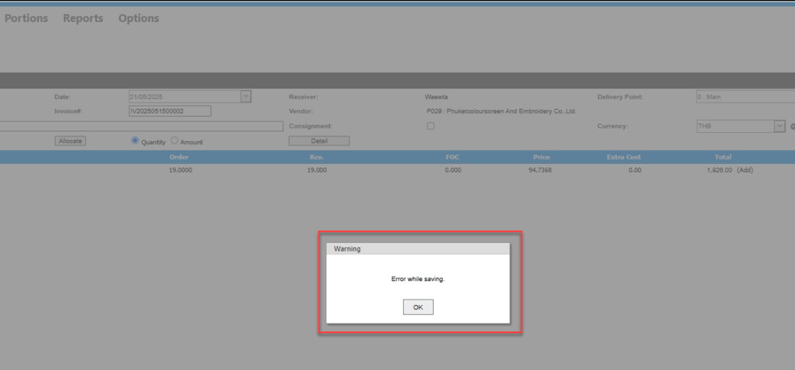

  
Title: Save Receiving แล้วระบบแจ้งข้อความ Error "While saving" เกิดจากอะไร  
Sample case:  ต้องการกด Save Receiving แต่ระบบแจ้ง Error แก้ไขอย่างไร  
Casuse of Problems: เกิดจาก ไม่ได้มีการ Set Default Order Unit ที่ Product  
  
เป็นการแจ้งเตือนว่า มีรายการไม่มีหน่วย Unit ทำให้เมื่อกด Save จึง Error  
Solution: แจ้ง Support เพื่อดำเนินการแก้ไข เพิ่มหน่วย Order Unit กับรายการที่ติดปัญหา  
วิธีป้องกันและแก้ไขปัญหา ให้ทำการ Set Default Order Unit ใน Product   
Tag: Procurement

Related topics:  
\#ต้องการแก้ไขหมายเลขInvoice ของเอกสาร Receiving แต่ Status Committed แล้วทำอย่างไร

\#Receiving รับเกินราคาPO ไม่ได้ ระบบแจ้ง Warning

\#ทำ Credit Note หาหมายเลขเอกสาร Receiving ไม่เจอ

\#Receiving รับเกินจำนวนของPO ไม่ได้ระบบแจ้ง Warning

