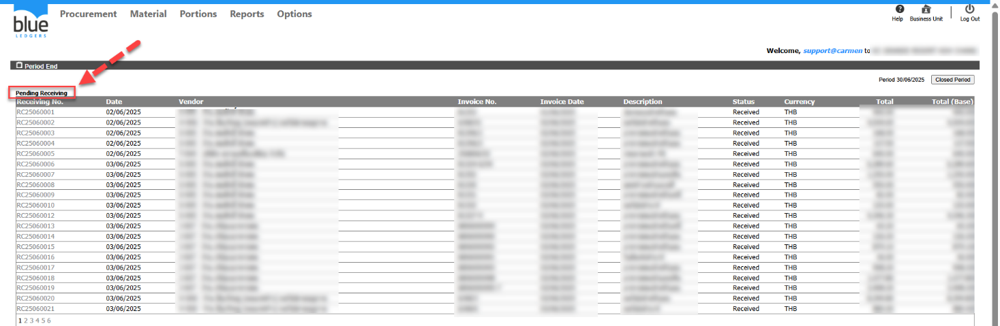
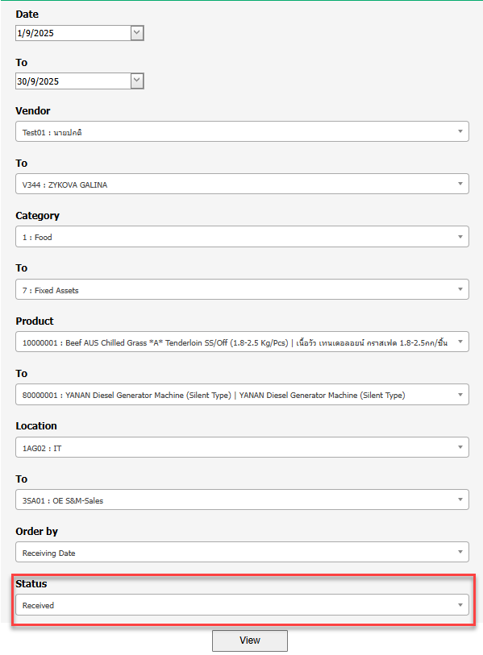
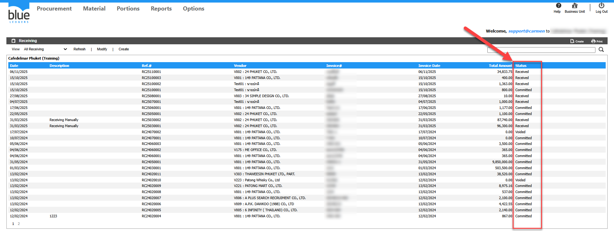

Title: ตรวจสอบ Receiving ที่ยังไม่ committed ได้อย่างไร

Sample case: ต้องการปิด Period แต่อยากทราบเอกสาร Receiving ในระบบที่ยังไม่ committed  
Cause of Problems:  
Solution: ตรวจสอบได้ 3 วิธี ดังนี้  
1\. ตรวจสอบที่หัวข้อ Period End  
วิธีตรจสอบและแก้ไข  
\- ตรวจสอบที่หัวข้อ Period End\(แสดงเฉพาะเอกสาร Receiving ภายใน Period นั้น ๆ\)  
ไปที่ 1\.Material>2\.Procedure>3\.Period End  
  
ระบบจะแสดงรายการ Receiving ที่ยังเป็น Status Received ภายใต้ Period ปัจจุบันของระบบ  
  
  
  
  
  
  
  
  
  
2\.Report Receiving Detail  
เลือก ข้อมูลที่ต้องการตรวจสอบ และเลือก Status ของ Receiving เป็น Received เพื่อดูรายการที่ยังไม่ได้มี   
  
  
  
  
  
  
  
  
กด View  ระบบจะแสดงข้อมูลเอกสารที่มี Status ของ Receiving เป็น Received มาแสดงตามรูปภาพด้านล่าง  
  
  
  
  
  
  
  
  
3\.ค้นหาจาก status บนหน้าจอ Receiving list  
พิมพ์คำว่า “Received” ลงในช่องค้นหา จะปรากฏ Status ของเอกสาร Receiving ที่ยังไม่เป็น Status Committed  
  
4\. ที่ View เลือกหัวข้อ Receiving not Committed  
  
Tag: Procurement

Related topics:  
\#ต้องการแก้ไขหมายเลขInvoice ของเอกสาร Receiving แต่ Status Committed แล้วทำอย่างไร

\#ทำReceiving ไม่ได้ แจ้งError

\#อยากรู้จำนวนสินค้าคงเหลือในระบบดูได้ที่ไหน

\#Receiving รับเกินราคาPO ไม่ได้ ระบบแจ้ง Warning

\#Receiving รับเกินจำนวนของPO ไม่ได้ระบบแจ้ง Warning

