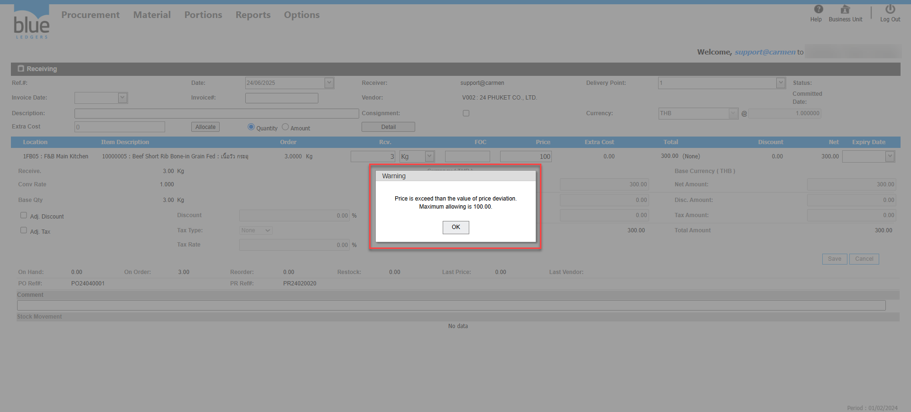

Title: Receiving รับเกินราคาจาก PO ไม่ได้ ระบบแจ้ง Warning	  
Sample case: ต้องการแก้ไขรายการ 10000005  ให้ราคามากกว่าที่ Po คือ Price 20  
  
Cause of Problems: กรอกราคาสินค้าเกินกว่า PO ซึ่งข้อมูลส่วนนี้มาจาก Price Deviation\(%\) ในตัวProduct  
Solution ไปที่ Product ที่ติดปัญหา ทำการแก้ไขในส่วนของช่อง __Price Deviation\(%\)__   
  
1\.ไปที่ Product 10000005   ทำการแก้ไข Price Deviation\(%\) ส่วนของราคา เป็น 100% กด Save  
  
2\.กลับไปที่เอกสาร Receiving ใส่ราคาที่ต้องการ กด Save ตามปกติ  

3\.ดำเนินการทำ Receiving  ได้เสร็จเรียบร้อย 

Related topics:  
\#ทำReceiving ไม่ได้ แจ้งError  
\#ต้องการแก้ไขหมายเลขInvoice ของเอกสาร Receiving แต่ Status Committed แล้วทำอย่างไร  
\#ทำ Credit Note หาหมายเลขเอกสาร Receiving ไม่เจอ

