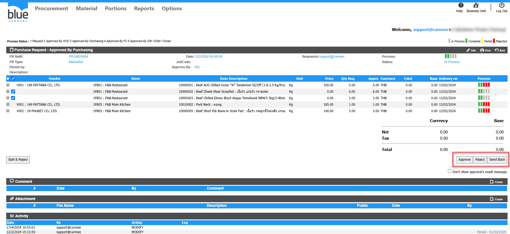

กด Approved PR ไม่ได้  
ตัวอย่าง PR24020004 กดเข้ามาแล้วไม่พบปุ่มปุ่ม Approved/Reject/Send Back ให้กด  
  
  
  
สาเหตุเกิดจากการเปิดเอกสารเมื่ออยู่ในหมวด View All ทำให้ไม่สามารถแก้ไขได้  
  
  
  
  
  
  
ไปที่หัวข้อ View  หรือตาม View Step เอกสารPR ของลูกค้า  
  
  
ทำการคลิกที่PR24020004หรือหมายเลขPR ของลูกค้า  
  
  
  
  
  
  
  
  
  
  
  
  
จะพบว่าปุ่ม Approved/Reject/Send Back ปรากฏขึ้นมาแล้วตามรูปภาพ  
Tag: Procurement

Related topics:  
\#สร้าง PR แล้วไม่พบ Product ที่ต้องการ  
\#Product Category อยู่ในหมวด PR Type ใด  
\#ไม่สามารถ ดึง PR ไปสร้างเป็น PO ได้  
\#PR 1ใบ Gen PO ได้ 2 PO  
\#สร้างPR ไม่เจอStore ให้เลือก  
\#หาหัวข้อ View PR ไม่เจอ

