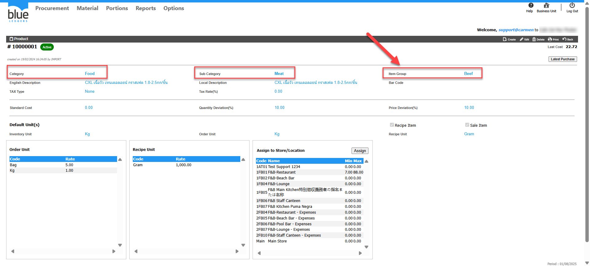

      Title: ต้องการตรวจสอบว่า item อยู่หมวด PR Type อะไร   
Sample case: Product 10000001 อยู่ภายใต้ PR Type อะไร  
Cause of Problems:   
Solution: 1\. ตรวจสอบว่า Product อยู่ใน Item group อะไร

ไปที่ Product ที่ต้องการตรวจสอบ ดูส่วนข้อมูลช่อง Item Group ว่าอยู่ Item Group ใด  
  
2\. ตรวจสอบว่า Item Group อยู่ใน PR type อะไร

 ไปที่ Procurement > Configuration > Category  
เลือกดูว่า Item Group นั้นอยู่ภายใต้ Category Type ใด   
Market list หรือ General ให้เลือกสร้าง PR Type ให้ถูกต้อง เนื่องจากตัวระบบหากสร้าง PR Type General ก็จะไม่พบProduct ที่อยู่ในหมวด Category Type ประภท Market list หรือ Asset   
  
  
  
  
Tag: Procurement

Related topics: 

\#สร้าง PR แล้วไม่พบ Product ที่ต้องการ  
\#ไม่สามารถ ดึง PR ไปสร้างเป็น PO ได้  
\#PR 1ใบ Gen PO ได้ 2 PO  
\#สร้างPR ไม่เจอStore ให้เลือก  
\#หาหัวข้อ View PR ไม่เจอ

