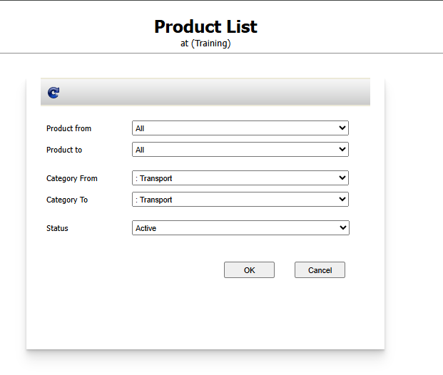
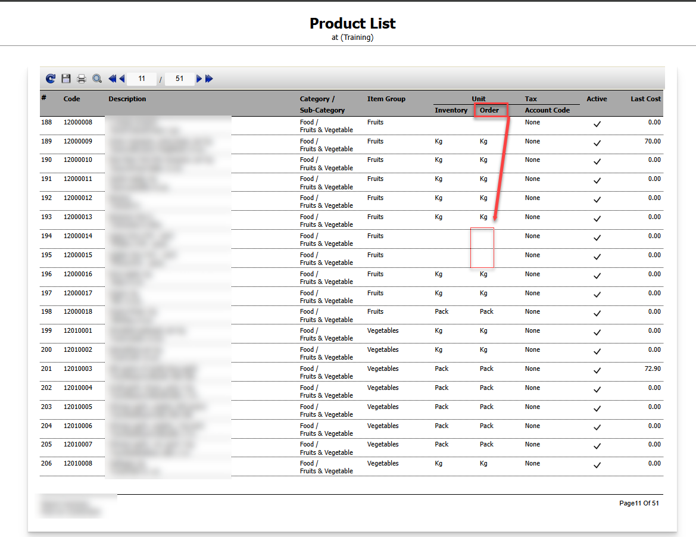

Title: วิธีตรวจสอบว่า Product ใดบ้างยังไม่กำหนด  Order Unit ในระบบ  
Sample case: ต้องการรู้ว่า Product ใดบ้างในระบบที่ยังไม่มีการ Set Order Unit  
Solution: ไปที่หัวข้อ Report > Product List > เลือกข้อมูลที่ต้องการตรวจสอบ > กด OK  
  
โดยดูข้อมูลในช่อง Unit  โดยแบ่งเป็น2รายการ คือ Inventory และ Order หากมีค่าว่างคือรายการ Product ที่ยังไม่มีการ Set unit แนะนำให้ทำการตั้งค่าที่ Product ให้สมบูรณ์เพื่อป้องกันการทำ Receiving ไม่ได้

  
  
  
Tag: Procurement

Related topics:  
\#สร้าง PR แล้วไม่พบ Product ที่ต้องการ

\#อยากรู้จำนวนสินค้าคงเหลือในระบบดูได้ที่ไหน

\#กด Approved PR ไม่ได้ 

\#เรียกดูReport Inventory Balance แล้วไม่พบStore ที่ต้องการจะดู

\#สร้างPR ไม่เจอStore ให้เลือก

\#หาหัวข้อ View PR ไม่เจอ

