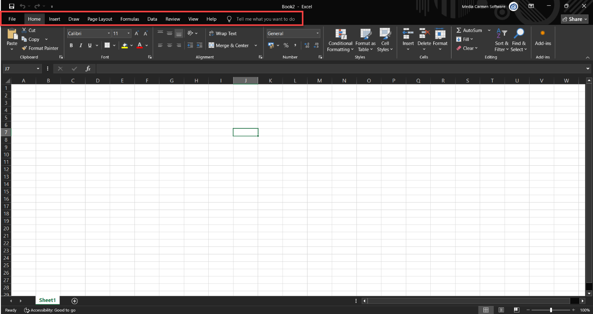
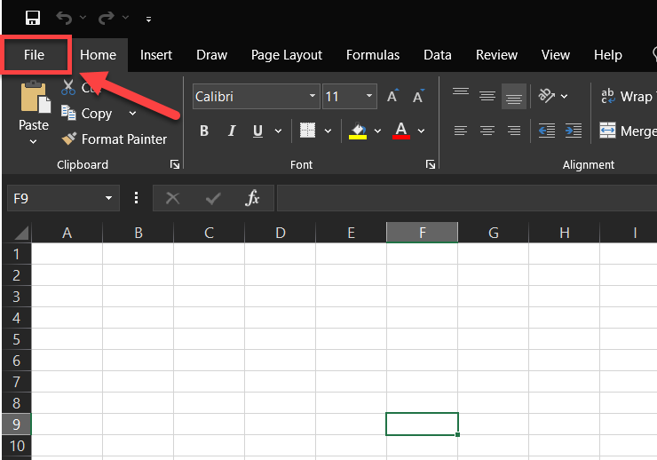
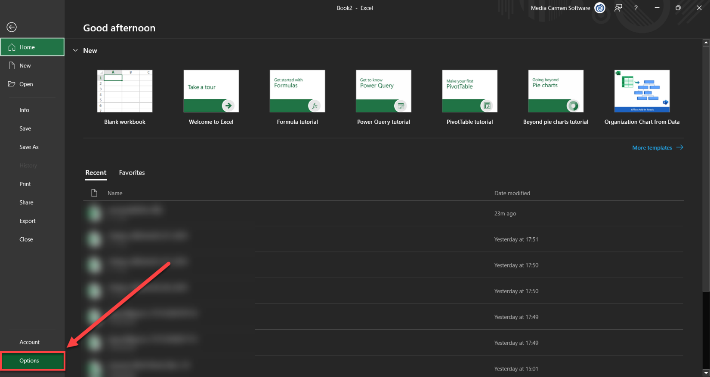
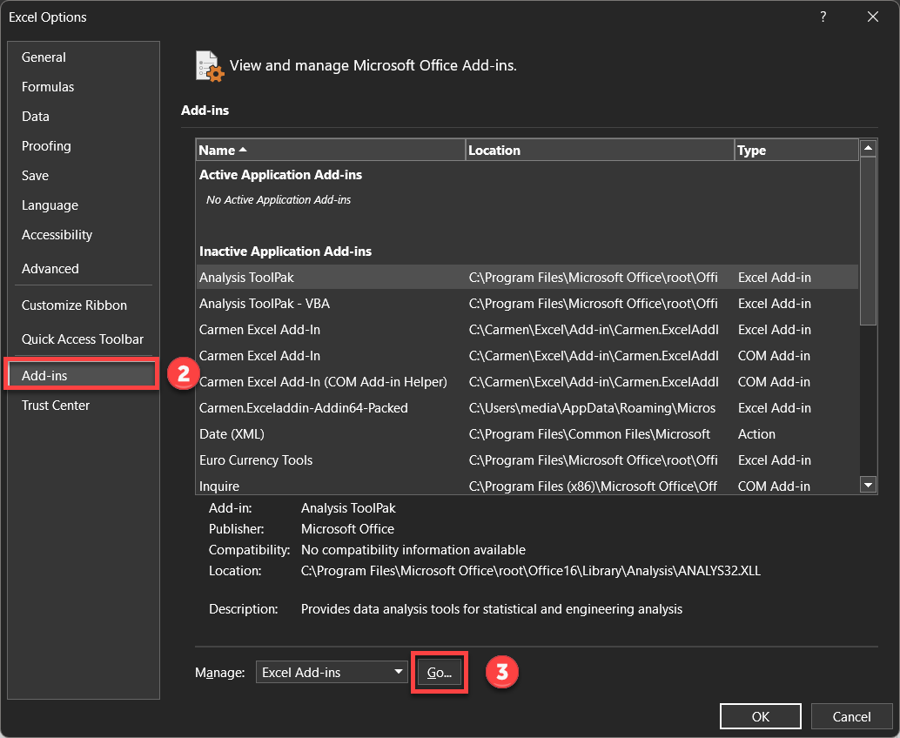
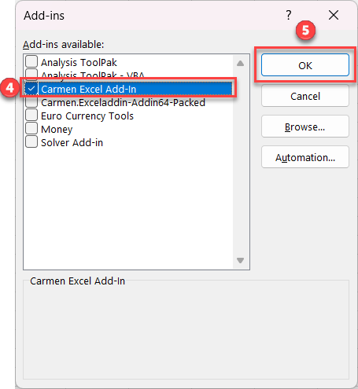
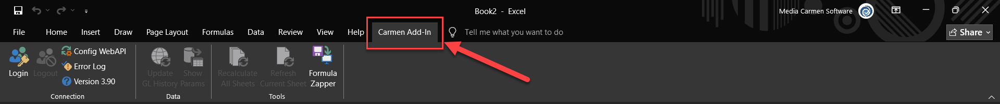

Tab Carmen Add\-In หายไป จะเพิ่มกลับมาอย่างไร  
วิธีแก้ไขเพิ่ม add in กลับมา  
  
1\.Click “File”

  
  
  
  
  
Click “option”

2\.Click “Add\-ins”  
3\.Cick GO  
  
  

  
4\. Check box at “Carmen AddIn”

5\.Click “OK” to complete the process\.  
  
Excel จะแสดง Carmen Add\-in ขึ้นมาตาม สามารถดำเนินการใช้งานได้ตามปกติ

  
Tag: Addin

Related topics:

\#Addin หายไป

\#การเพิ่ม Addin กลับมาใน Excel

