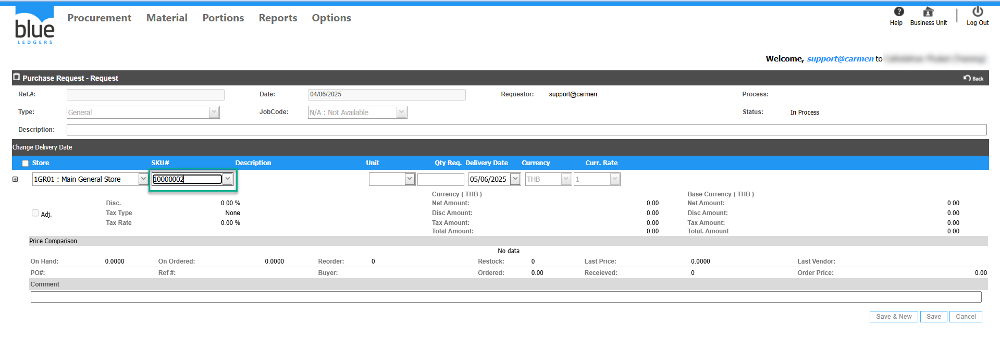
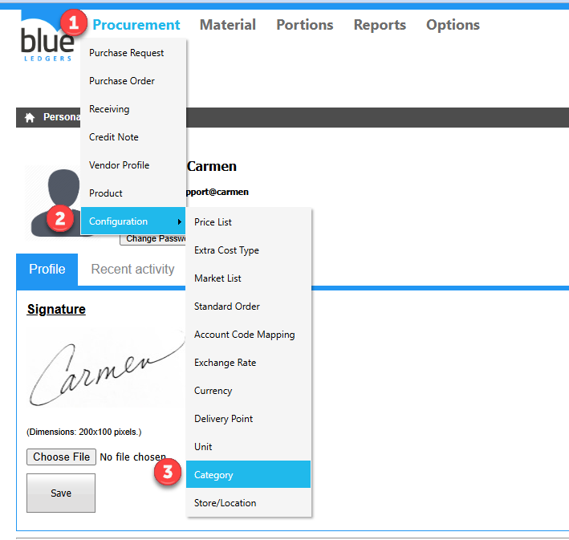
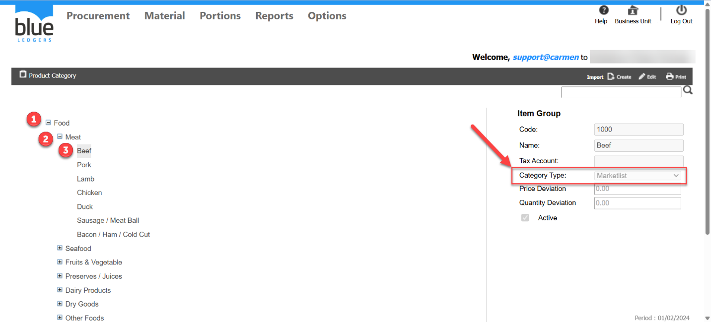
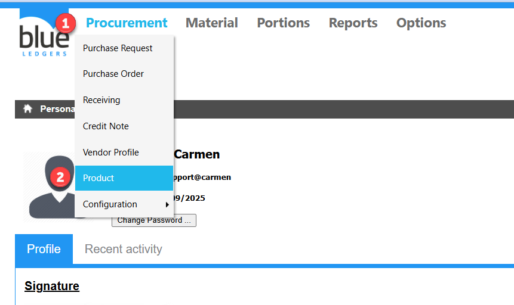
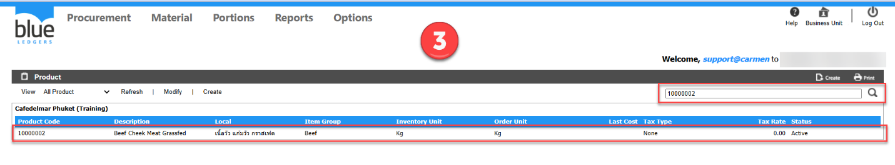
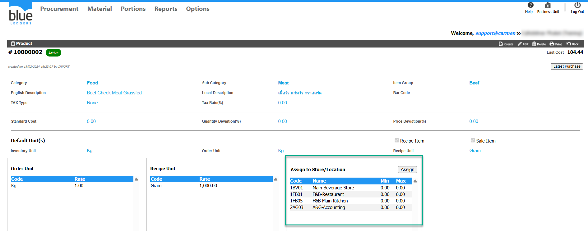
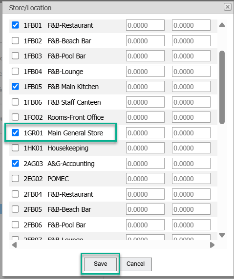
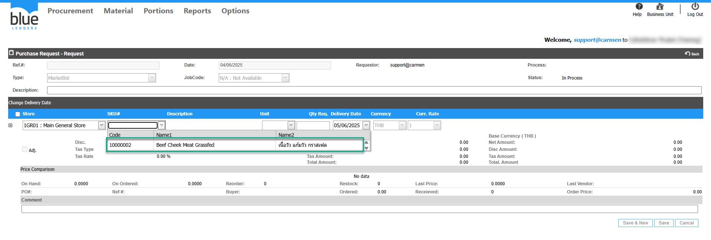

Title: สร้าง PR แล้วไม่พบ Product ที่ต้องการ  
Sample case: ต้องการเลือก Product __10000002__   สั่งซื้อเข้าที่ Store 1GR01 แต่เมื่อสร้าง PR แล้วไม่พบรายการสินค้า  
  
Cause of Problems:  เกิดจาก 2 ส่วน ดังนี้  
1\. Product ไม่ได้อยู่ใน Category Type ของ PR ที่สร้าง  
2\. Product ไม่ได้ถูก Assign to Store/Location  
Solution:  
\- Product ไม่ได้อยู่ใน Category Type ของ PR ที่สร้าง สามารถตรวจสอบได้ดังนี้  
1\. เข้าเมนู Procurement   
2\. Configuration  
3\. Category   
  
1\.1\. เลือก Category >Sub Category>Item Group  
จากตัวอย่างคือ   
1\. Category \(Food\)  
2\. Sub Category \(Meat\)  
3\. Item Group \(Beef\)  
จากตัวอย่าง Product 10000002  อยู่ใน Category Type Market List หากสร้าง PR Type General ก็จะไม่พบ Product ตัวนี้  
  
\- ตรวจสอบว่า Product นี้ถูก Assign to Store/     Location ไว้ที่ 1GR01 แล้วหรือยัง  
Solution:  
1\. ไปที่เมนู Procurement  
2\. Product  
  
3\.คลิกเลือก Product 10000002 หรือพิมพ์ Product Code 10000002 หรือตาม Product ที่ต้องการ ในช่องค้นหา  
  
  
4\. ดูในช่อง Assign to Store/Location ว่า Store 1GR01หรือ Store ที่ต้องการ ถูกติ๊กเลือกไว้หรือไม่  
  
  
5\. หากยังไม่ได้ assign ให้ทำการ Assign to Store/Location ที่ 1GR01 หรือ Store ที่ต้องการและกด Assign และกด Save  
  
  
6\. กลับไปที่ PR จะปรากฏรายการ Product __10000002__  และสามารถดำเนินการทำเอกสาร PR ได้ตามปกติ   
  
Tag: Procurement  
Related topics:

\#สร้าง PR แต่ไม่พบ product ที่ต้องการ

\#การ assign location ให้ product

\#การ assign product ให้ location  
\#Product Category อยู่ในหมวด PR Type ใด  
\#สร้างPR ไม่เจอStore ให้เลือก  
\#หาหัวข้อ View PR ไม่เจอ  
\#กด Approved PR ไม่ได้

