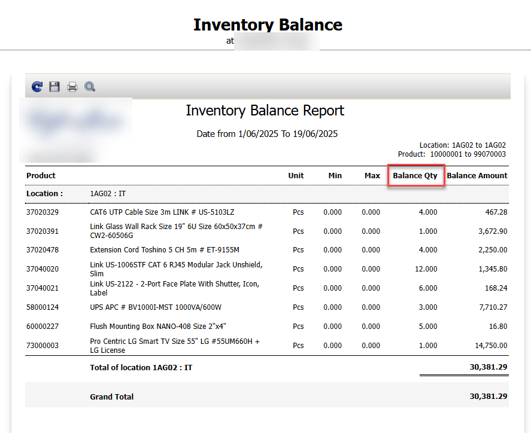
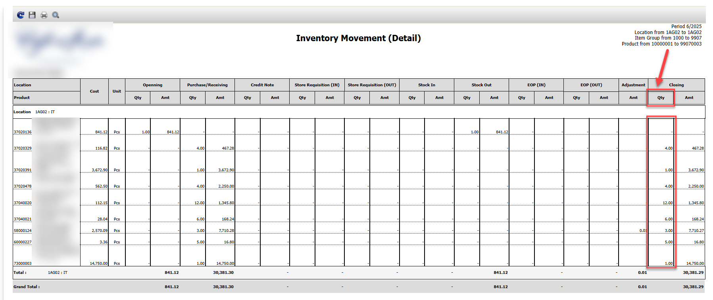
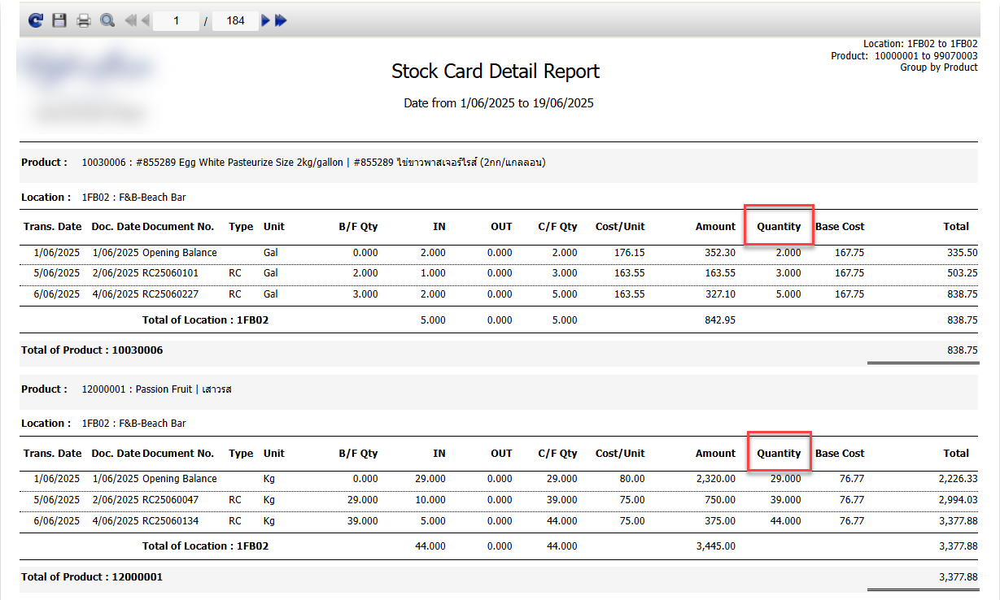

อยากรู้จำนวนสินค้าคงเหลือในระบบดูได้จากที่ไหนบ้าง  
ไปที่ Reports สามารถดูได้จาก3 Report ดังนี้  
1\.Inventory Balance  
ช่อง Balance Qty คือจำนวนสินค้าคงเหลือ หากไม่มีสินค้าหรือสินค้าเป็น 0 จะไม่แสดงที่ Report นี้  
2\. Inventory Movement Detail

ช่อง Closing Qty คือจำนวนสินค้า ตาม Period ที่เลือก  

3\. Stock Card Detailed  
ช่อง Quantity คือจำนวนสินค้าคงเหลือ ตามเอกสารที่ทำในระบบ Date from ที่เลือก  
Tag: Procurement

Related topics:

