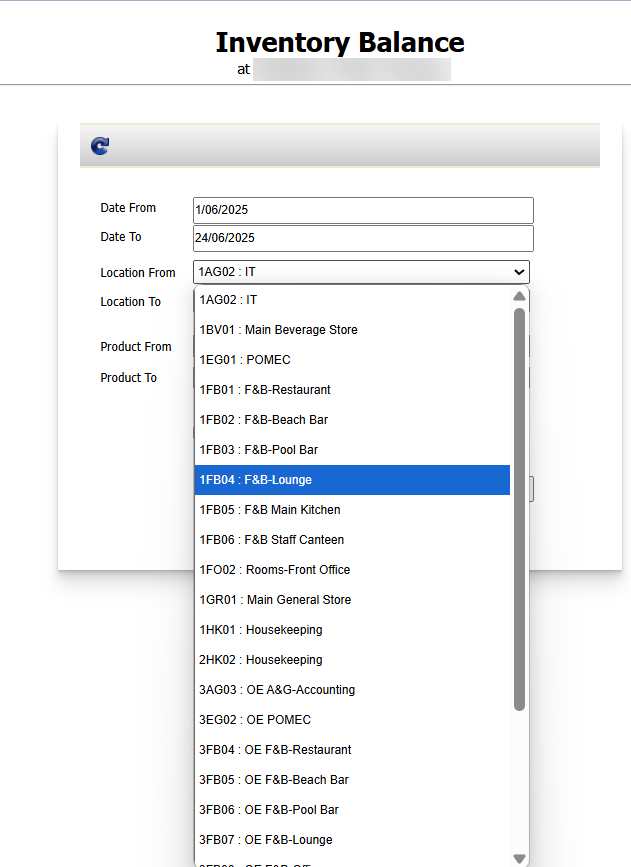

เรียกดูReport Inventory แล้วไม่พบStore ที่ต้องการเกิดจากอะไร  
ตัวอย่าง เรียกดูReport Inventory Balance จะดูสินค้าของ Store 2AG03 แต่ไม่พบStoreให้เลือก  
  
  
สาเหตุ:เกิดจากStore นั้นเป็น Store Default Zero	เป็นสโตร์ค่าใช้จ่าย ไม่ถูกบันทึกเป็นInventory ระบบจึงไม่นำมาบันทึกข้อมูล  
หากเป็นการ Receiving เข้าStore ค่าใช้จ่ายให้เรียกดูReport Receiving Detail เพื่อดูข้อมูลการทำรับ  
  
  
  
  
Tag: Procurement

Related topics:  
\#สร้าง PR แล้วไม่พบ Product ที่ต้องการ  
\#Product Category อยู่ในหมวด PR Type ใด  
\#สร้างPR ไม่เจอStore ให้เลือก  
\#หาหัวข้อ View PR ไม่เจอ  

