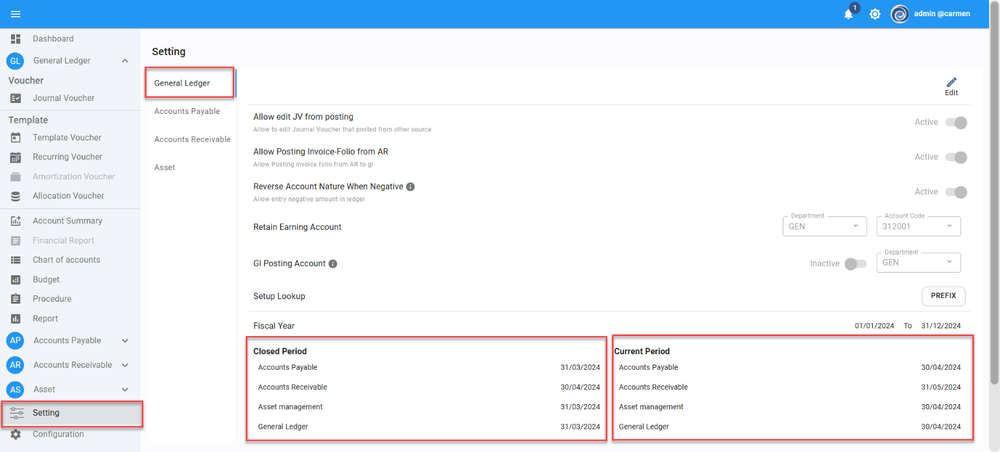

 Title: วิธีตรวจสอบ Current Period ของ module ใน Carmen  
Sample case:  ต้องการทราบว่าตอนนี้ module ต่าง ๆ เป็นPeriodอะไร  
Causes of Problems:  
Solution: ไปที่หัวข้อ Setting >General Ledger   
จะปรากฏคอลัม Closed Period\(Period ที่ปิดแล้ว\)   
และ Current Period \(Period ปัจจุบัน\)   
จากตัวอย่างคือ จะแสดงแต่ละ module ว่าเป็น Period ใดบ้าง เช่น AP ตอนนี้คือ 30/04/2024 เป็นต้น  
Tag:   
Related topics:

