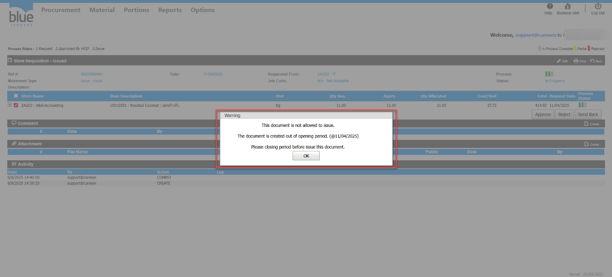
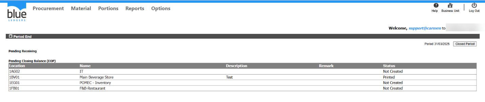
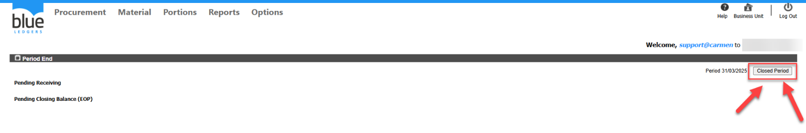
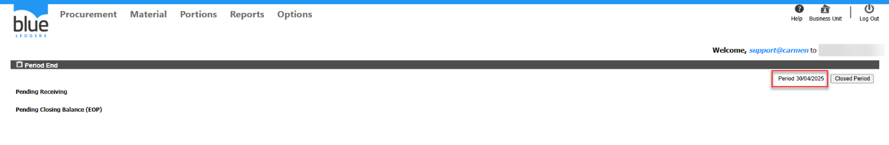
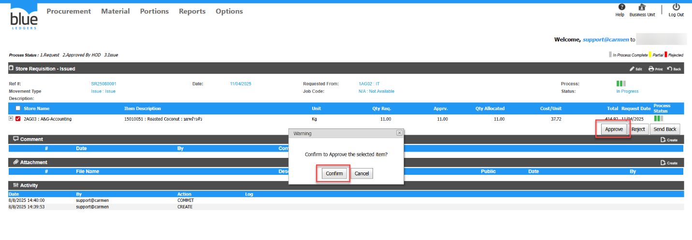
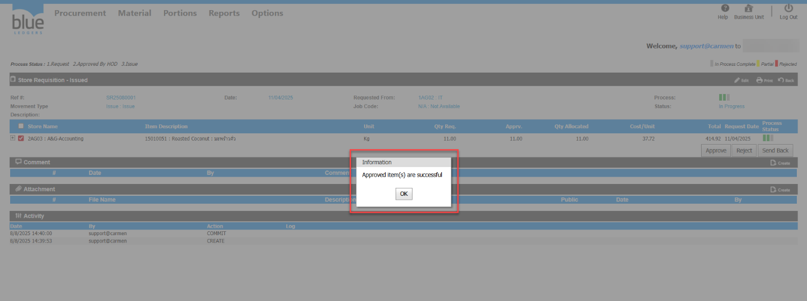

Commitเอกสาร SR ไม่ได้  
ตัวอย่าง ต้องการCommit SR25080001 ระบบแจ้ง The document is not allowed to issue\.  
  
สาเหตุ เกิดจากPeriod ยังไม่ได้ปิด ระบบจึงฟ้องให้ปิดเพื่อเป็นPeriod เดือน4 จากตัวอย่างคือSR Date เดือน4 แต่Period ในระบบคือ Period 31/03/2025 ทำให้ไม่สามารถCommit ได้  
แก้ไขโดย ไปปิดPeriod ให้เป็นเดือน4 แล้วทดลองกดCommit อีกครั้ง  
ไปที่หัวข้อMaterial>Procedure> Period End ระบบจะแสดงเอกสารRC ที่ค้างและStore ที่ยังไม่ได้ทำการClosing Balance \(EOP\) จะต้องดำเนินการให้เรียบร้อยจึงจะสามารถกดClosed Period ได้  
  
หลังจากดำเนินการจัดการเอกสารที่ค้างในระบบเรียบร้อยแล้วให้ทำการกดปุ่ม Closed Period  
  
  
  
จะปรากฏเป็นข้อมูล Period 30/04/2025  
กลับไปที่เอกสาร SR25080001 กด Approve ก็สามารถกด Commit เอกสารได้แล้ว  
  
Tag:   
Related topics:

