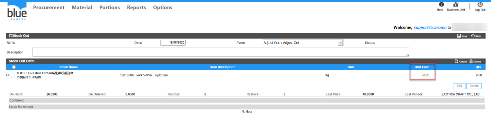

Title : Cost/Unit ใน Stock Out แสดงไม่เท่ากับ Receiving ที่ต้องการปรับปรุงเกิดจากอะไร  
Sample case: ต้องการทำStock Out รายการ 10010004  Store 1FB05 ด้วยCost 40 ตามเอกสาร RC25080003  
Cause of Problems: วิธีการคำนวณ Cost ของระบบ  
  
  
Solution: ไม่สามารถแก้ไขให้ Stock Out ออกตาม Cost/Unit ของเอกสาร RC ได้เนื่องจาก Cost/Unit จะคำนวณตามวิธีการคำนวณ Cost ที่ตั้งค่าเอาไว้   
1\.วิธีการคำนวณ Cost แบบ Average  
2\.วิธีการคำนวณ Cost แบบ Fifo  
Tag:   
Related topics:

