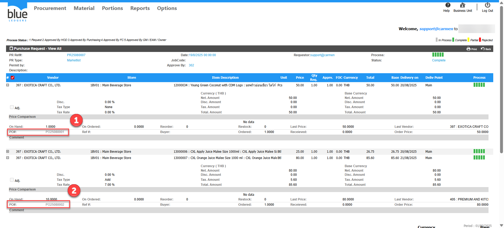
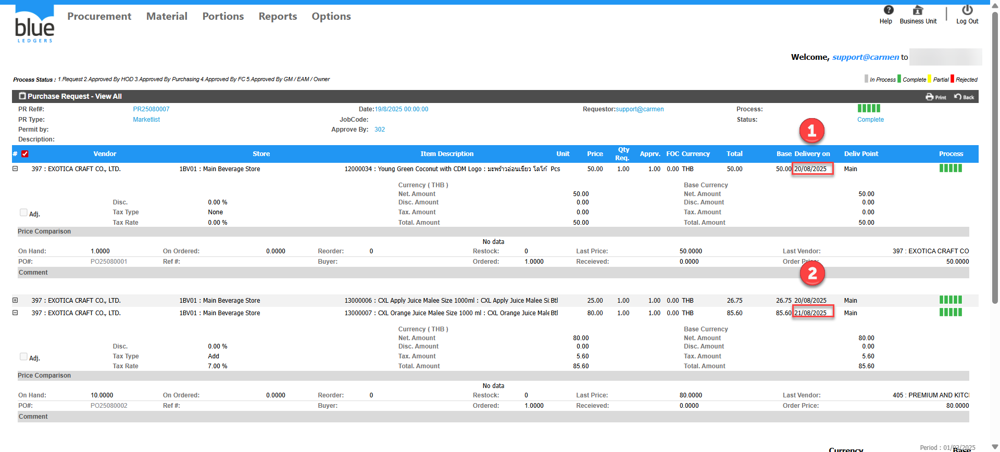

PR 1ใบ มี 1 vendor ทำไมระบบสร้าง PO 2 ใบ  
ตัวอย่าง PR25080007 Gen แล้วได้PO 2ใบ คือ PO25080001และ PO25080002  
  
สาเหตุเกิดจาก มี Delivery on 2 วัน คือ 20/08/2025 และ 21/08/2025 ทำให้ระบบแยกเป็น2PO  
ระบบจับจาก Vendor และ Delivery on   
  
Solution: ไม่สามารถรวมเป็น1POได้เนื่องจากระบบจับจาก Vendor และ Delivery on หากต้องการรวมต้องทำPRใบใหม่ และ แก้ไข Delivery on ให้เป็นวันที่เดียวกัน 

สำหรับ PO ที่ออกไปแล้ว ให้ทำการ Close PO  
Tag:   
Related topics:

