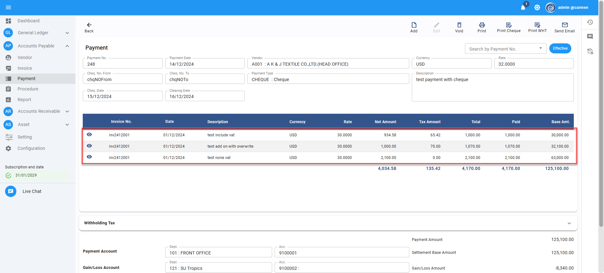
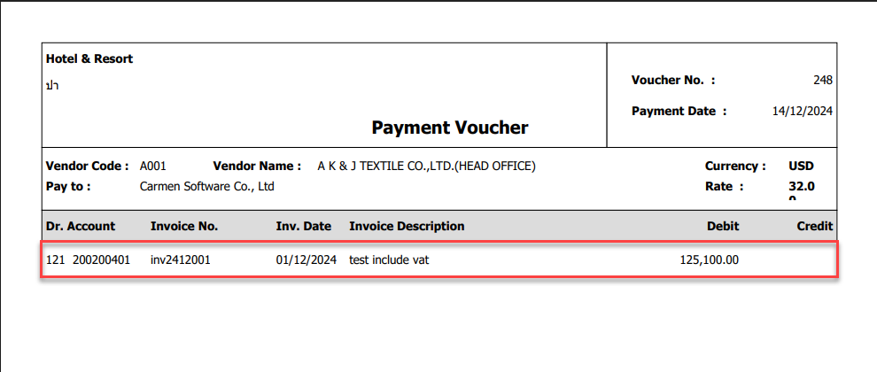
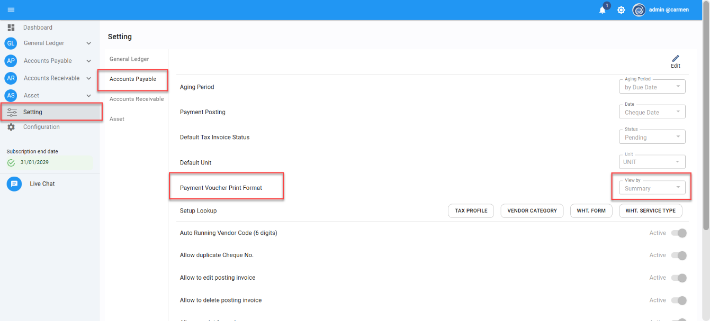
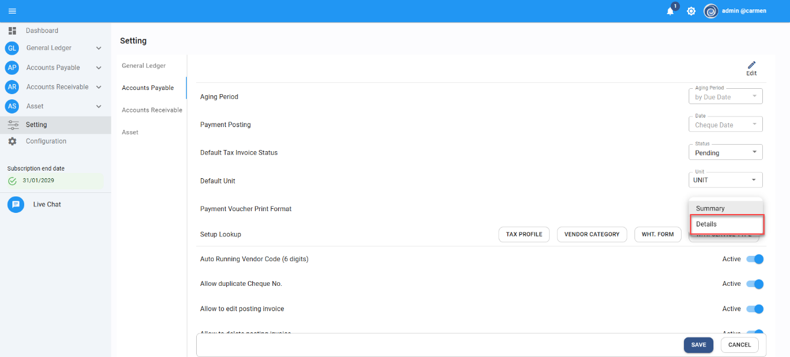
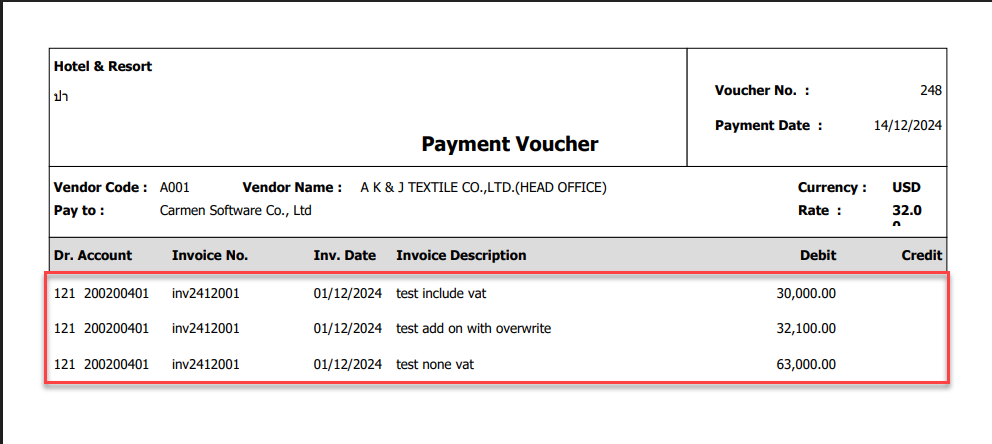

Title: Payment มี detail ของ invoice หลายรายการแต่ Print Payment voucher แล้ว รายการเดียว เกิดจากอะไร และ จะแก้ไขอย่างไร  
Cause of Problems: การตั้งค่าหัวข้อ Payment Voucher Print Format ไม่ได้กำหนดเอาไว้แบบ Detail  
Sample case: Print Payment แสดงแค่ 1 รายการใน Invoice มี 3 รายการ แก้ไขอย่างไร  
  
  
  
  
  
  
  
  
  
  
  
  
Solution: ไปที่หัวข้อ Setting > Account Payable > Payment Voucher Print Format  กด Edit  
เลือกหัวข้อ View by ตั้งค่าให้เป็นแบบ Detail เพื่อแสดงรายละเอียดของรายการใน Payment  กด Save   
  
  
  
  
  
  
  
  
  
  
  
  
  
  
  
  
  
กลับไปที่รายการ Payment ดังกล่าว และทดลองกด Print อีกครั้ง ระบบจะแสดงรายการแบบ Detail เรียบร้อย  
Tag:   
Related topics:  

