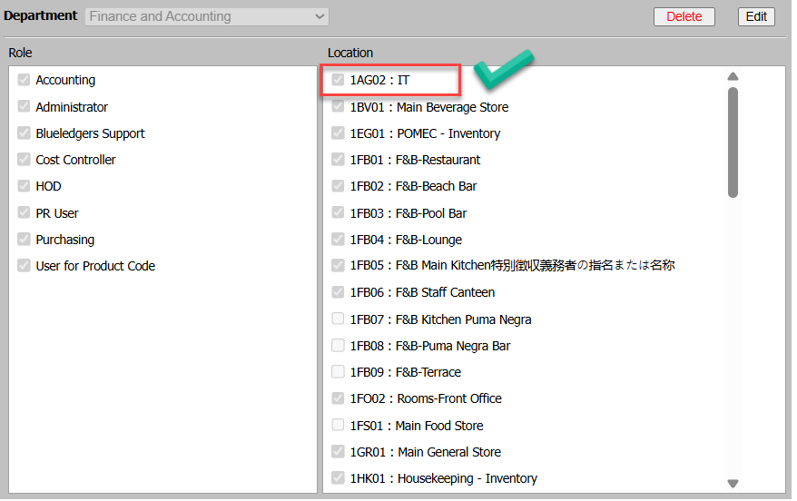

Title: Physical Count ไม่แสดง Store ที่ต้องการนับ  
Sample case:  ต้องการ Physical Count Store “IT” แต่เมื่อกด Create แล้วไม่พบ Store ดังกล่าว  
  
 Cause of Problems: ไม่มีการเปิดสิทธิ์การมองเห็น Store ใน User หรือ Type ของStep ไม่เป็น Type Enter Counted Stock

Solution:  ตรวจสอบข้อมูล2 ส่วน ดังนี้  
1\.ตรวจสอบว่าStore ดังกล่าวเป็น EOP Type Enter Counted Stock หรือไม่  
  
2\.ตรวจสอบสิทธิ์ในการเข้าถึง Store ของ User   
ไปที่  Options > Administrator > User ยังไม่มีการเปิดการมองเห็นให้ User ดำเนินการให้เรียบร้อย  
  
กด Create อีกครั้ง จะปรากฏ Store IT ขึ้นมาเรียบร้อย ดำเนินการ Physical Count ได้ตามปกติ  
  
Tag:   
Related topics:

