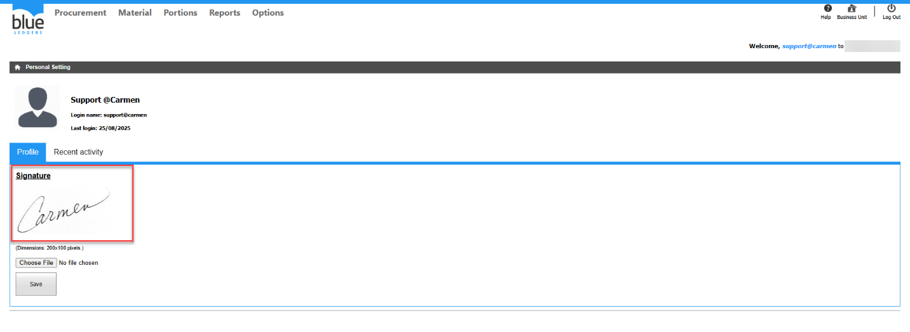

Title : ต้องการเพิ่มหรือเปลี่ยนลายเซ็นต์ User  
Sample case:  ต้องการเพิ่มเลายเซ็นต์ในระบบ ทำอย่างไร  
Cause of Problems:ไม่สามารถลบลายเซ็นต์เดิมได้ ต้องทำการUpdate File ลายเซ็นต์  
  
Solution: ไปที่ Options> Personal Setting> Choose File   
เลือก File รูปภาพลายเซ็นต์ ขนาดไม่เกิน \(Dimensions: 200x100 pixels\.\) กด Open และกด Save  
  
  
  
ระบบจะแสดงลายเซ็นต์ที่ทำการอัพโหลดไปจาก File  
  
Tag:   
Related topics:

