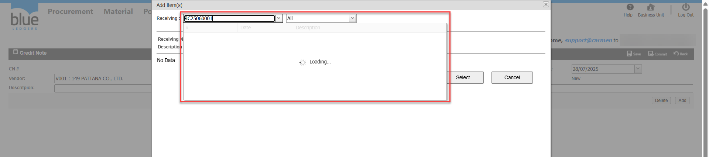
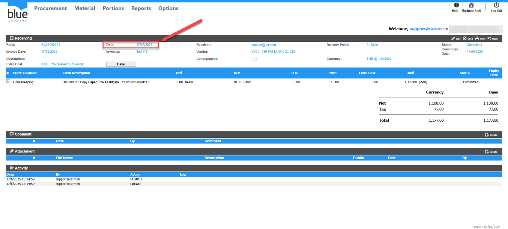
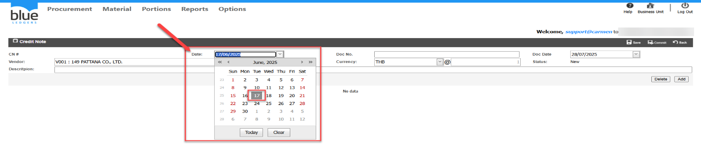

Title: สร้าง Credit Note แต่หาหมายเลขเอกสาร Receiving ไม่เจอ  
Sample case:  ต้องการทำ CN กับเอกสาร RC25030019 แต่เมื่อค้นหาแล้วไม่พบเอกสารใบนี้  
  
Cause of problem : เลือก Date ใน CN ก่อน วันที่ของเอกสาร Receiving

Solution: ตรวจสอบเอกสาร RC ว่า Date เป็นวันที่ใด และเลือก Date ในเอกสาร CN ให้เป็นวันเดียวกัน หรือเป็นวันที่อยู่หลังจากวันที่ Receiving  
จากตัวอย่างคือ 17/06/2025 ระบบยึดจาก Date ของเอกสาร RC  
  
  
  
Tag:   
Related topics:

