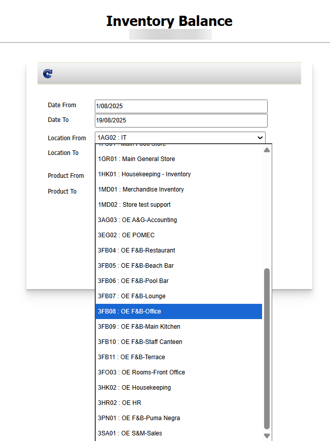

Title: เรียกดู Report Inventory Balance แล้วไม่พบ Store ที่ต้องการจะดู  
 Sample case:  ต้องการเรียกดูStore 2AG03 แต่ไม่พบStore ดังกล่าวตามรูปภาพ  
Casuse of Problems: Store เป็น Type แบบค่าใช้จ่าย Default Zero  
  
  
  
  
Solution: ตรวจสอบว่าStore ดังกล่าวเป็น Enter Counted Stock หรือ Default System หรือไม่   
สังเกตุในช่อง EOP ว่าแสดงเป็นประเภทใด   
  
หากเป็น Default Zero ระบบจะไม่ปรากฏข้อมูลเนื่องจากเป็นStore ค่าใช้จ่ายครับ   
หากเป็นการทำ Receiving ให้ใช้Report Receiving Detail และเลือกวันที่ทำรับเพื่อดูข้อมูล   
  
Tag:   
Related topics:

