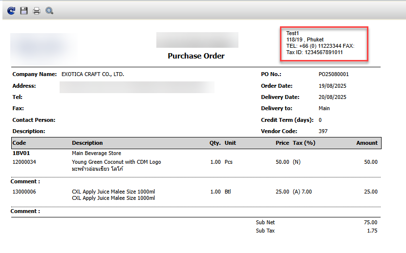
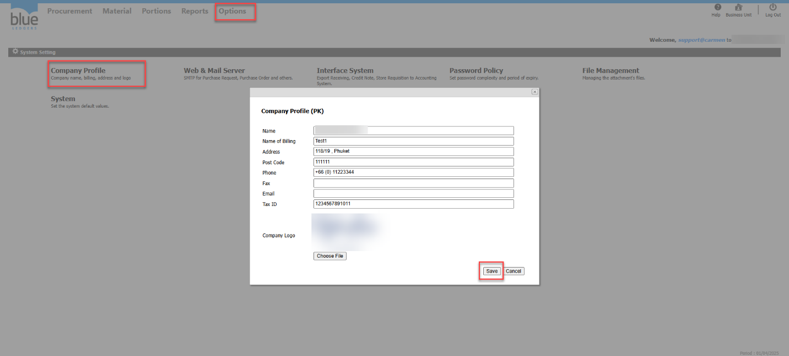
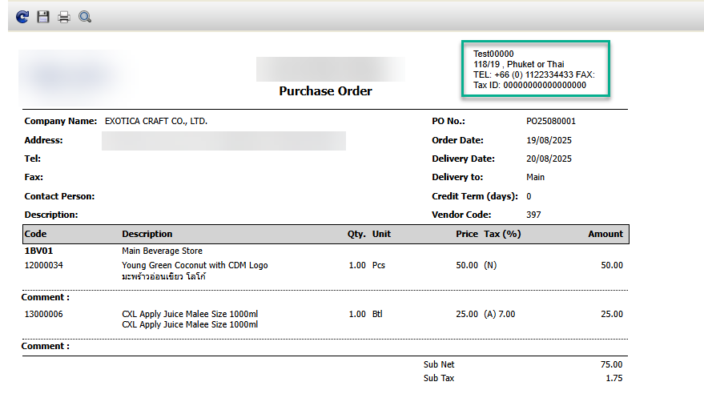

Title : แบบฟอร์ม PO แสดงข้อมูลบริษัทไม่ถูกต้อง แก้ไขอย่างไร

Cause of Problems: ข้อมูลใน Company Profile ไม่ถูกต้อง  
Sample case : ฟอร์ม PO Company Profile ผิดต้องการแก้ไข  
  
Solution: ไปที่หัวข้อ Options > System Setting > Company Profile กด Edit   
ทำการแก้ไขข้อมูลตามต้องการ กด Save   
  
  
  
  
ทดลองกด Print PO อีกครั้ง ข้อมูลจะเปลี่ยนแปลงตามการแก้ไข  
  
Tag:   
Related topics:

