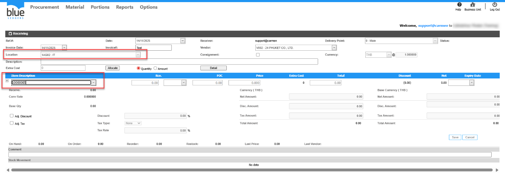
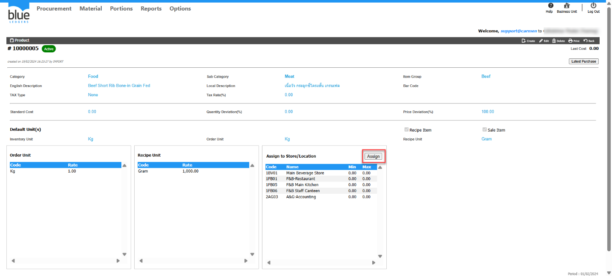
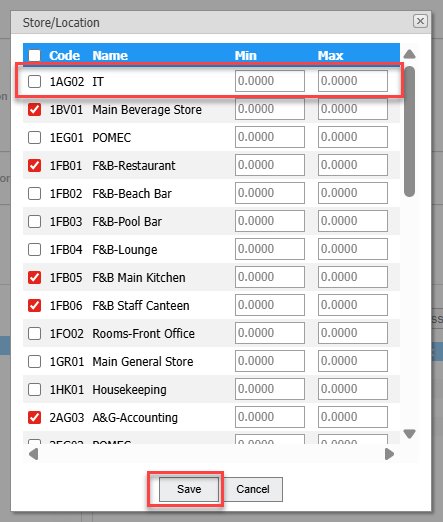
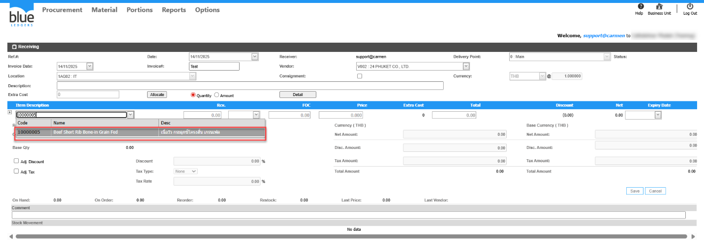

Title: Receiving Manually เลือก Store แล้วมองไม่เห็น Product  
Sample case:   ต้องการทำรับเข้า Store IT แต่เลือกแล้วไม่พบ Product 10000005    
Cause of Problems: ไม่ได้ทำการ Assign to Store/Location ในรายการ Product  
   
Solution: ไปที่ Product ทำการ กดปุ่ม Assign เลือก Store ที่ต้องการ ทำการติ๊กถูกที่ Store และทำการกด Save  
  
  
กลับไปที่เอกสาร Receiving Manuanlly ก็จะพบ Product ปรากฏขึ้นมาให้ทำรายการตามปกติ  
  
Tag:   
Related topics:

