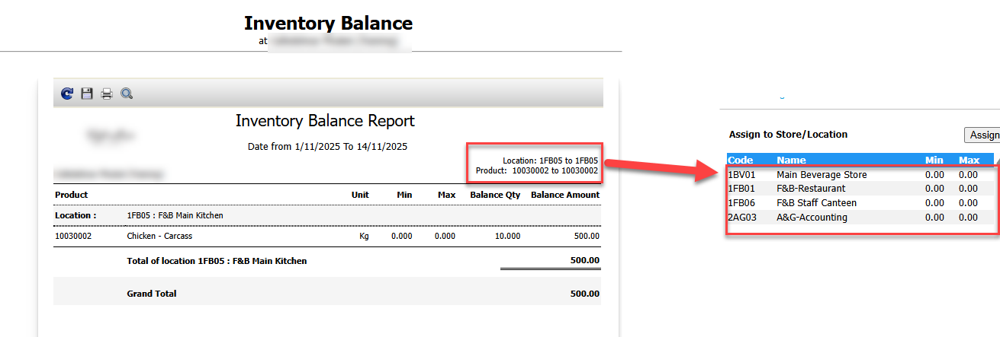

Title: ต้องการ clear ให้ Product on hand เป็น 0 ก่อน ยกเลิกใช้งานใน location ที่ต้องการ จะต้องทำอย่างไร  
Sample case:  Product 10030002 ปรากฏ on hand ที่รายงาน Inventory Balance ที่ location 1FB05 : F&B Main Kitchen แต่ต้องการจะเยิกเลิกการใช้สินค้าใน location นี้แล้ว  
Cause of Problems: ยังมีข้อมูล On hand ค้างอยู่  
  
Solution:   
1\.ทำเอกสาร Stock Out ออกให้เป็น 0 โดยตรวจสอบยอดของคงค้างด้วย Report  Inventory Balance จากตัวอย่าง คือ Qty คงค้าง 10 Kg   
  
2\.นำการ Assign to Store/Location Store 1FB05 ออกจาก Product 10030002 แล้วทดลองเรียก Report  Inventory Balance ว่ายังมี Qty คงเหลืออีกหรือไม่  
จากตัวอย่างก็จะไม่พบสินค้าคงเหลือแล้ว  
  
  

Tag: 

Related topics:

