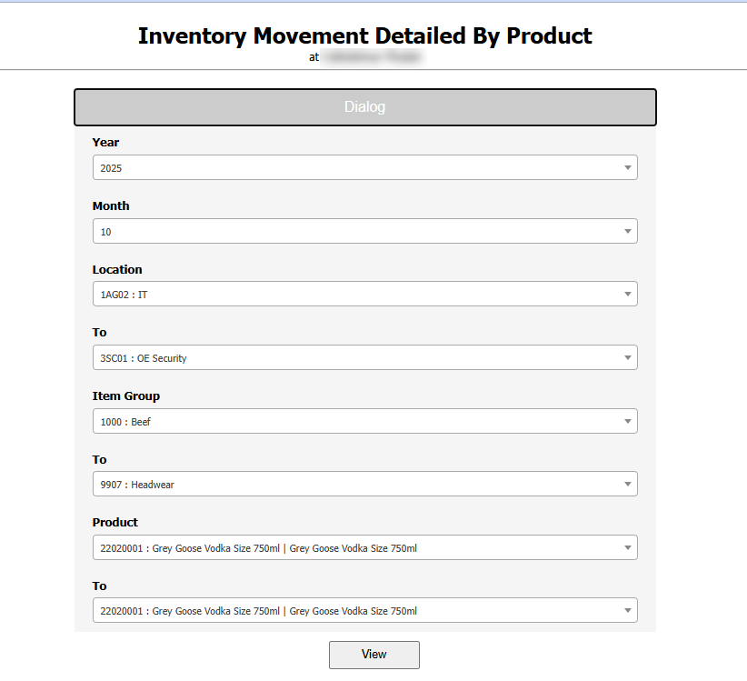
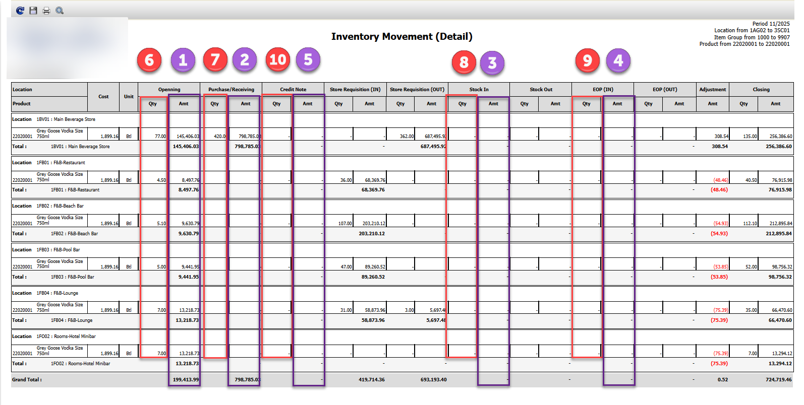

Title: วิธีการคำนวณ Cost แบบ Average  
Sample case:   ต้องการทราบว่า Cost/Unit ของรายการ 22020001 เป็นเท่าใด ณ เดือน 11  
Cause of Problems:  
Solution: เรียก Report Inventory Movement Detailed By Product  
โดยให้ทำการเลือก Period ที่ต้องการ  
และเรียกทุก Store/Location   
  
  
  
  

วิธีคำนวณหา average cost นำเอา total amount และ total qty มาคำนวณ

\(1 \+ 2 \+ 3 \+ 4 – 5\) / \(6 \+ 7 \+ 8 \+ 9 – 10\)  
\(199413\.99\+798785\.03\+0\+0\-0\) / \(77\+4\.50\+5\.10\+5\+7\+7\+420\-0\)  
\(998199\.02\) / \(525\.6\)  
Cost/Unit = 1899\.16   
  
Tag: 

Related topics:

