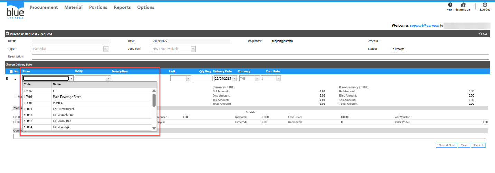
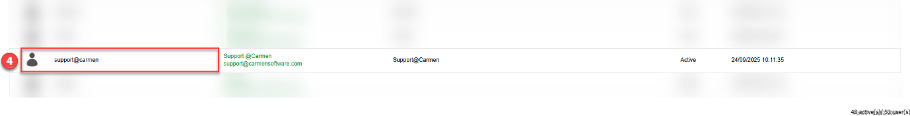
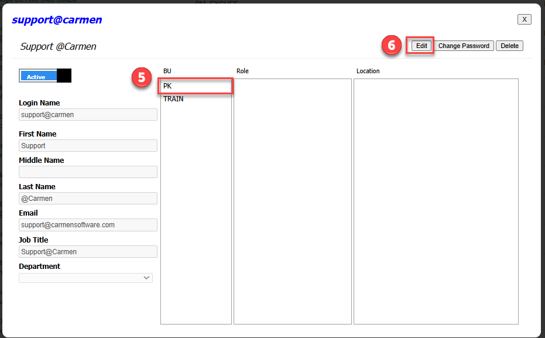
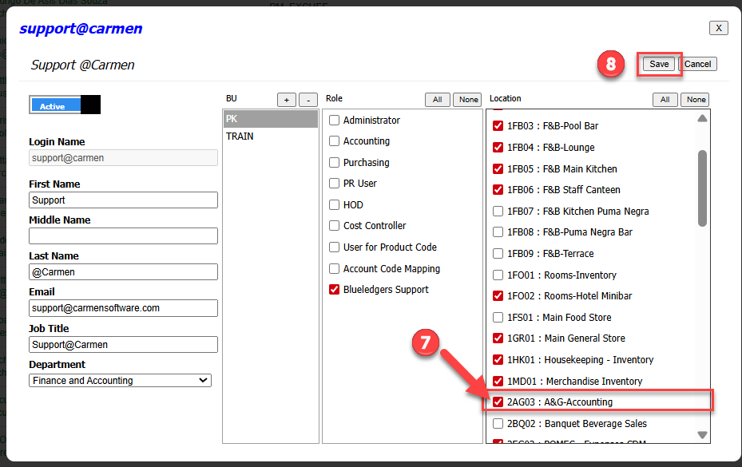
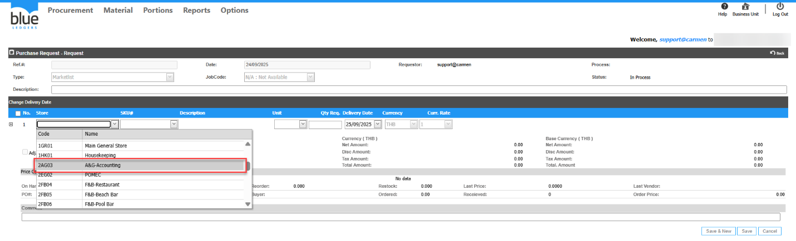

Title: สร้าง PR แต่ไม่พบ Store ที่ต้องการขอซื้อ  
Sample case:  ต้องการสร้าง PR ของ Store A&G\-Accounting แต่ไม่พบ Store A&G\-Accounting ให้เลือก  
Cause of Problems: : User ที่เปิด PR อาจจะไม่ได้ถูก Assign  Location ให้มองเห็น Store/Location นี้ทำให้มองไม่เห็น  
  
Solution: Assign location ให้กับ user ที่ต้องการ

 เข้าเมนู  
1\.Options  
2\.Administrator  
3\.User  
  
4\.คลิก User ที่ติดปัญหา จากตัวอย่าง คือ User: Support   
  
  
  
  
  
  
5\.คลิกเลือก BU ที่ใช้งานจากตัวอย่างคือ BU PK   
6\.กดปุ่ม Edit  
  
7\.เลือก Store A&G\-Accounting   
8\.กด Save   
  
  
กลับมาที่เอกสาร PR ก็จะพบ Store A&G\-Accounting ให้คลิกเลือกแล้วครับ ตามรูปภาพด้านล่าง  
  
Tag:   
Related topics:

