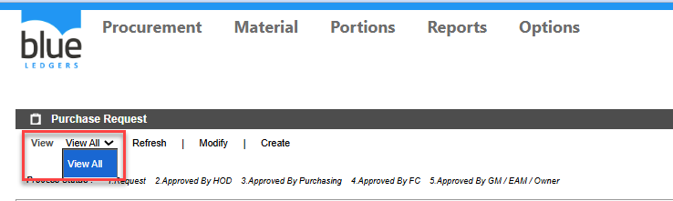
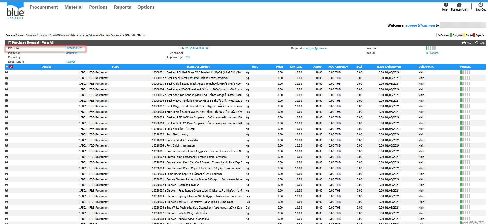
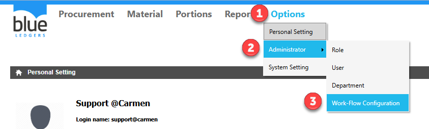
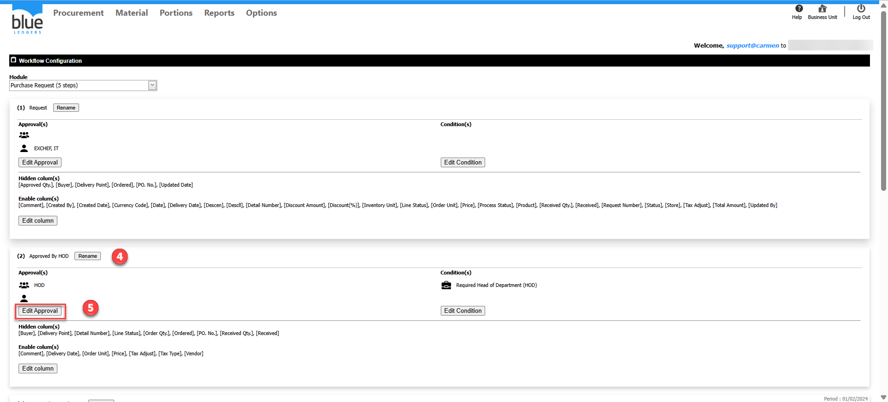
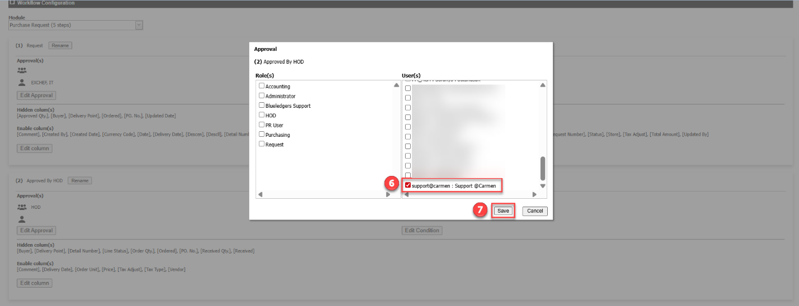
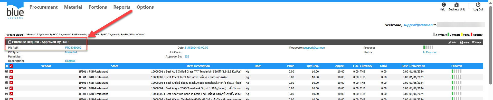

Title: ใน  View ไม่พบขั้นตอนการ Approve PR ที่ต้องการเกิดจากอะไร  
Sample case:   ต้องการ approve PR24050002 ที่ Step Approved By HOD แต่ที่ View ไม่พบ “Approved By HOD”  
Cause of Problems: User ที่ติดปัญหา ไม่ได้ถูก Assign เอาไว้ที่หัวข้อ Step Approved By HOD ใน Workflow Configuration ส่วนของ Purchase Request    
  
  
  
  
  
  
  
Solution: Assign user ที่ต้องการลงใน approval step ที่ต้องการ

ไปที่เมนู   
1\.Options  
2\. Administrator  
3\. Workflow Configuration  
  
4\.ไปที่ Step Approved By HOD ใน Workflow Configuration จากตัวอย่างคือ \(2\) Approved By HOD  
5\.กดปุ่ม Edit Approval   
  
  
  
  
  
  
6\.ทำการเลือก User ที่ต้องการเปิดสิทธิ์การ Approved By HOD จากตัวอย่าง คือ User:Support  
หมายเหตุ:การเลือกสามารถเลือกได้ทั่ง2แบบ คือ 1\.Role\(s\) 2\.User\(s\)  
7\.กด Save  
  
กลับไปที่ หัวข้อ PR คลิก View จะปรากฏ View ของ Approved By HOD เรียบร้อย   
ทำการคลิก Approved By HOD จะพบเอกสาร กด PR24050002 ที่ Step Approved By HOD เรียบร้อย   
สามารถดำเนินการ Approved เอกสารได้ตามปกติ  
\(หากไม่พบ ไปที่หัวข้อ \#Required Head of Department \(HOD\)\)  
  
Tag:   
Related topics:

